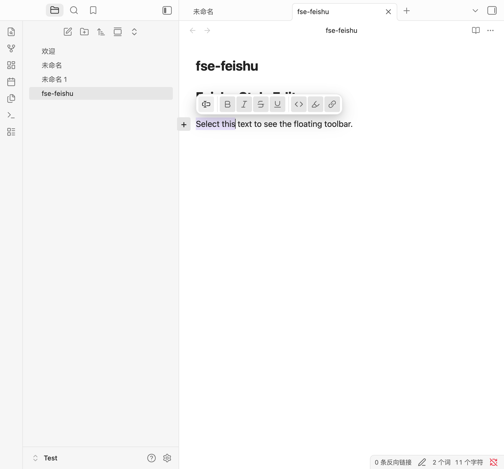

# Feishu Style Editor

为 Obsidian 增加飞书风格的文档编辑能力，同时保留完整的 Obsidian Markdown 语法。

## 功能

### 斜杠菜单（块面板）

在行首或空格后键入 `/` 打开块面板，按飞书的方式组织为三段：

- **Basic**：两列图标网格 —— Text、Heading 1–3、有序/无序列表、任务列表、引用，图标按块类型着色，右侧标注 `#` `##` 等快捷标记。
- **Common**：带说明的列表 —— Callout（二级菜单可选 note / tip / info / success / question / warning / danger / example）、Table、Image、Video or file、Formula、Link to note。
- **Advanced**：Code block、Divider、Quote with source、Toggle list、Properties、Term and definition。

输入关键字即时过滤，此时合并为一条扁平结果列表；`↑` `↓` 移动，`Enter` 确认，`Esc` 关闭并撤销已输入的 `/`。
行中间（URL、`and/or`）的 `/` 不会被拦截，仍是普通字符。

### 悬浮工具栏

选中文本后弹出分段式工具栏，形如飞书的浮动条：

`转为 ▾` │ `B` `I` `S` `U` │ `` ` `` `==` 🔗

- 左段是块类型转换入口（`Turn into`），展开完整块面板。
- 中段是行内字形：加粗、斜体、删除线、下划线（`<u>…</u>`）。
- 右段是代码、高亮、链接。

点击任一段的按钮只改 Markdown 源码，工具栏在应用块命令后会自动收起，避免遮住刚生成的内容。

### 行前 `+` 手柄

光标所在行左侧显示 `+`，点击打开同一个块面板：

- 空行直接写入块标记；
- 有内容的行**就地转换**（`正文` → `# 正文`）；
- 行内选中文本会随块一起移动。

上述功能均可在插件设置中分别开关（开关会持久化）。




## 开发

```bash
pnpm install
pnpm run dev         # 开发模式（监听）
pnpm run build       # 构建 production
pnpm run lint        # ESLint
pnpm run deploy:test # 部署到 Test/ vault
pnpm run verify:live # 对运行中的 Obsidian 做端到端验证
```

### 真机验证

`verify-live.sh` 通过 Obsidian CLI 与 Chrome DevTools Protocol 驱动真实运行的应用，覆盖斜杠菜单、过滤与执行、转义撤销、方向键选择、悬浮工具栏、`+` 手柄、块面板分组结构与设置持久化。

脚本遵循「不抢窗口」原则：CodeMirror 的输入管线只接受可信事件，因此需要真实按键的检查集中在一个约 10 秒的前台阶段——脚本先记录当前前台应用并明确提示，结束后再切回去；其余检查全部在后台完成。

```bash
pnpm run build && pnpm run deploy:test
# 让 Test vault 处于前台后
pnpm run verify:live
```

脚本会把按键事件派发到目标编辑器自身的 DOM，而不是走操作系统键盘队列，避免与正在使用该窗口的人抢占输入。

## License

MIT
